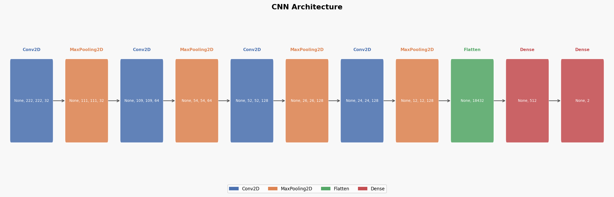
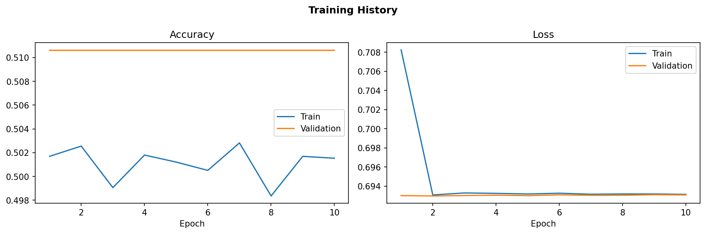
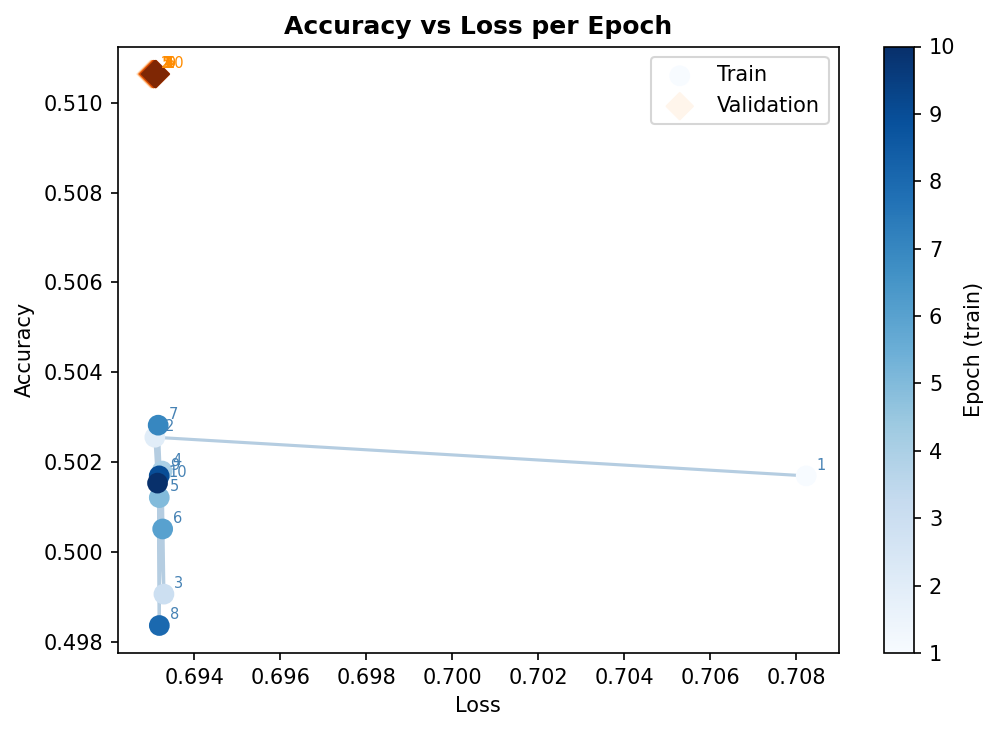
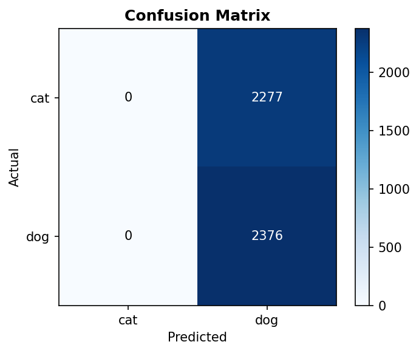

# Cats vs Dogs CNN Classifier

A convolutional neural network trained from scratch to classify cats and dogs using TensorFlow/Keras.

## Project Structure

| File | Responsibility |
|---|---|
| `config.py` | Constants: paths, image size, batch size, epochs, normalization values |
| `data.py` | Download, load, and preprocess the dataset |
| `model.py` | Build, compile, and train the CNN |
| `visualization.py` | Architecture diagram, training history, confusion matrix, accuracy vs loss |
| `main.py` | Orchestrates all steps |

## Dataset

The [cats_vs_dogs](https://www.tensorflow.org/datasets/catalog/cats_vs_dogs) dataset is downloaded automatically on first run and split 80/20 into train/val:

- **Train**: 18,609 images
- **Validation**: 4,653 images
- **Classes**: `cat` (0), `dog` (1)

Images are resized to **224×224** and normalized using ImageNet mean/std.

## Model Architecture

A sequential CNN with 4 convolutional blocks followed by fully-connected layers:



| Layer | Output Shape | Params |
|---|---|---|
| Conv2D (32 filters, 3×3, ReLU) | 222×222×32 | 896 |
| MaxPooling2D (2×2) | 111×111×32 | 0 |
| Conv2D (64 filters, 3×3, ReLU) | 109×109×64 | 18,496 |
| MaxPooling2D (2×2) | 54×54×64 | 0 |
| Conv2D (128 filters, 3×3, ReLU) | 52×52×128 | 73,856 |
| MaxPooling2D (2×2) | 26×26×128 | 0 |
| Conv2D (128 filters, 3×3, ReLU) | 24×24×128 | 147,584 |
| MaxPooling2D (2×2) | 12×12×128 | 0 |
| Flatten | 18,432 | 0 |
| Dense (512, ReLU) | 512 | 9,437,696 |
| Dropout (0.5) | 512 | 0 |
| Dense (2, Softmax) | 2 | 1,026 |

**Total parameters**: 9,679,554 (36.92 MB)

## Training

- **Optimizer**: Adam
- **Loss**: Sparse categorical cross-entropy
- **Epochs**: 10
- **Batch size**: 32
- **Regularization**: Dropout (0.5) after the Dense(512) layer

### Results

| Epoch | Train Acc | Val Acc | Val Loss |
|-------|-----------|---------|----------|
| 1 | 66.7% | 74.7% | 0.515 |
| 2 | 78.7% | 81.0% | 0.423 |
| 3 | 84.4% | 84.1% | 0.365 |
| 4 | 88.6% | 86.1% | 0.354 |
| 5 | 91.9% | 86.6% | 0.338 |
| 6 | 94.3% | 87.0% | 0.367 |
| 7 | 96.2% | 88.1% | 0.376 |
| 8 | 96.9% | 87.9% | 0.451 |
| 9 | 97.5% | **88.4%** | 0.473 |
| 10 | 97.9% | 87.5% | 0.554 |

Peak validation accuracy: **88.4%** (epoch 9).

### Training History



### Accuracy vs Loss



### Confusion Matrix



## Setup

```bash
uv run main.py
```

The dataset is downloaded automatically if not already present.
